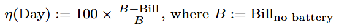
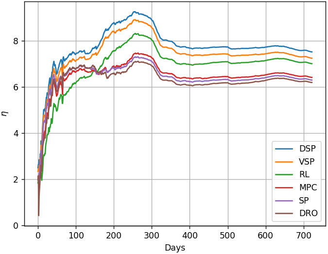

# EMS-RL-DRO

[](https://opensource.org/licenses/MIT)


This repository provides the implementation of advanced Energy Management System (EMS) strategies combining **Reinforcement Learning (RL)** and **Distributionally Robust Optimization (DRO)**. The EMS problem considered involves managing a domestic battery under uncertain electricity consumption and photovoltaic production.

---
## 🧩 Theoretical Foundation

This repo supports the findings and methodology presented in:
- **Mimouni et al.**_"A Comparative Study of Multi-Stage Stochastic Optimization Approaches for an Energy Management System"_(preprint 2025)

---

## 🔍 Project Overview

Modern EMS solutions must make sequential decisions under uncertainty. This repo implements and compares multiple decision-making strategies for EMS:
- Distributionally Robust Optimization (DRO)
- Reinforcement Learning (RL)

All models are benchmarked on the **same EMS problem** involving a battery, a consumption signal, and a photovoltaic production signal. Full details of the EMS model and the problem formulation are in the article.

---

## 📁 Repository Structure

The repo is divided into three main modular packages:

### 🔧 `pyopticontrol/` 
> Core EMS models and algorithms
- DRO formulation and SDAP algorithm
- Model definitions and battery constraints

### 🌲 `pyreductree/`  
> Scenario tree reduction using nested Wasserstein barycenters  
- Implements a boosted version of the Kovacevic-Pichler's [Nested Tree Reduction algorithm](https://dan-mim.github.io/files/reduction_tree.pdf) as in [this github](https://github.com/dan-mim/Nested_tree_reduction)
- Compatible with large-scale scenario sets

### 🎯 `pystochoptim/`  
> Stochastic & robust optimization primitives  
- Problem abstraction for multistage control
- Feasibility projections
- Wasserstein ambiguity set handling

---

## ⚡ Getting Started

To run the test notebooks or reproduce numerical results, first install the required dependencies from **all packages**.

```bash
conda create -n ems-env python=3.9
conda activate ems-env
pip install -e pyopticontrol/
pip install -e pyreductree/
pip install -e pystochoptim/
```

If you use MPI for parallel computations (recommended for DRO/SDAP), install:
```bash
conda install mpi4py
```

Run the Test files to execute your favorite optimization methods. For exemple for DRO run:
```bash
python pystochoptim/Test/test_pystochoptim.py
```
---

## 🔬 Problem Overview

We solve a multistage stochastic optimal control problem where a battery is managed to minimize an energy bill under:
- Random consumption and photovoltaic production
- Electricity price variations
- Battery state-of-energy and power constraints
- Measurement delays (non-anticipativity)

The cost is computed using real electricity prices and battery physics over a time horizon.

---

## 🤖 Methodologies Implemented

### 🔁 Model Predictive Control (MPC)
Solves a deterministic optimization at each time using a single forecasted scenario.

### 📉 Deterministic-Stochastic Programming (DSP)
Computes a robust control against a set of scenarios with fixed probabilities. This algorithm belongs to IFPEN and is not provided in this open source repository.

### 🎲 Distributionally Robust Optimization (DRO)
Uses an ambiguity set defined via the Wasserstein distance to hedge against distributional misspecification. The implementation follows the SDAP algorithm from:
- [De Oliveira et al. (2021)](https://link.springer.com/article/10.1007/s11228-021-00600-5)

### 🧠 Reinforcement Learning (RL)
A tabular Q-learning agent learns directly from historical data to control the battery without any model assumptions.

---

## 📊 Numerical Experiments

Numerical experiments compare the performance of each method on test datasets. The SDAP algorithm and the RL agent are shown to yield competitive results with good robustness.

After *cross-validations*, the methods are tested over a *2 year period*: 2022-01-22 to 2024-01-22.
<p align="center">
  
</p>

<p align="center">
  
</p>

More details can be found [in this presentation](https://github.com/dan-mim/EMS-RL-DRO/blob/main/EMS-RL-DRO-optim.pdf).
---

## 🏢 Industrial Use Case

> This repository is already **in use at IFPEN** for EMS and battery control research.

The provided code is **production-grade**, modular, and scalable to large real-world datasets. It supports:
- Parallel execution (MPI)
- Fast scenario reduction
- Real-time learning and control

---

## 📜 License

Distributed under the MIT License. See [LICENSE](LICENSE) for details.

---

## 👤 Author

Developed by [Daniel Mimouni](https://github.com/dan-mim) in collaboration with IFPEN.

